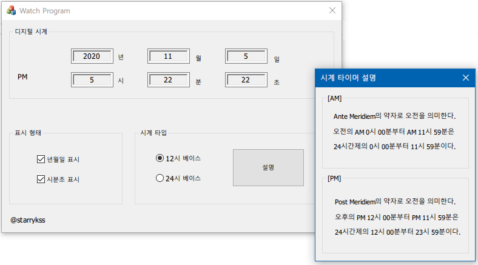

# Watch Program
[2020-10-29] Watch Program with MFC Programming (C++)

### 프로그램 개발 환경
- Language : C++
- OS : Microsoft Windows 10
- IDE : Microsoft Visual Studio 2019 16.4

### 기능 설명
- 대화 상자 기반 애플리케이션(Dialog-Based Application)
- 도서 등록, 대출 및 반납 기능 구현

### 실행 화면

